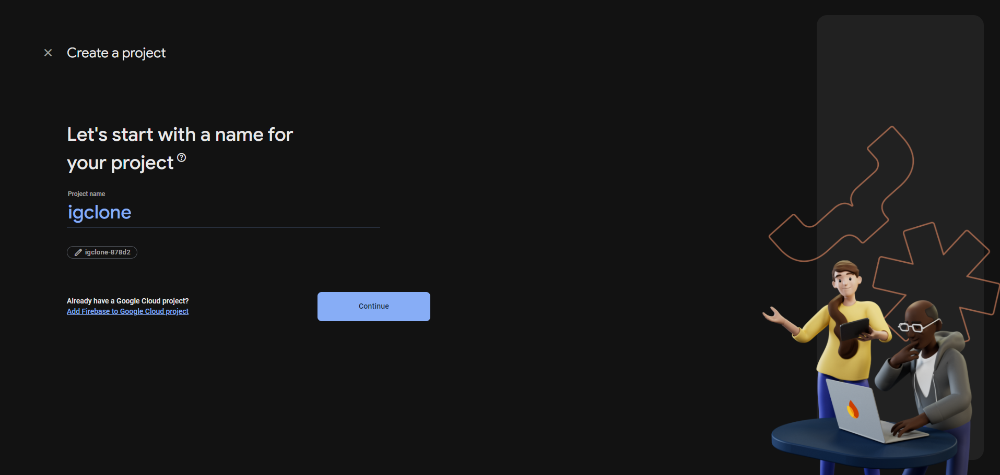
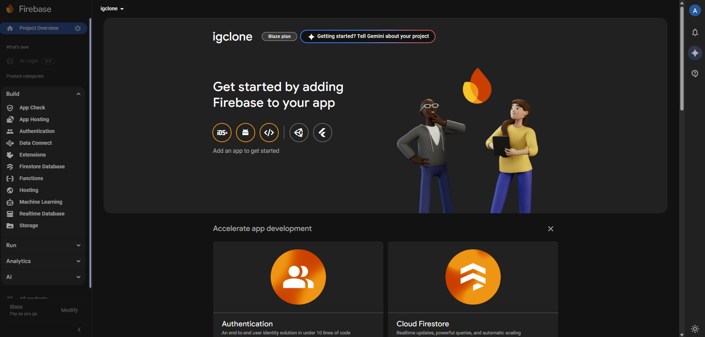
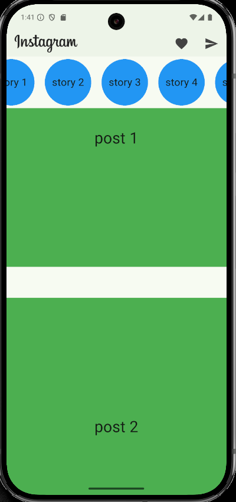

# igclone

*App Name - *IGClone*
*Goal - To build a scalable instagram clone using Dart/Flutter Framework to showcase what I've learned so far, and hopefully learn some more.*
*Target Audience - Potential employers.*

**Project Duration** : 25 July 2025 - 2 August 2025 (Ongoing improvements will follow.)
**Platform** - Primarily android, future development will target iOS, Web and Desktop.

### Development Log ###

# Day 1 - 25 July 2025

**Technical Research and Foundation Setup**
1. *Tech Stack Finalization*:
    - Selected Firebase for the backend services (Auth,Firestore,Storage,FCM, etc.)
    - Strongly considering Cloud Firestore over Data Connect.
        Key reasons:
            Realtime capabilities
            Offline support
            NoSQL architecture, which fits better with social media-style apps

2. *Widget Exploration*
    - Researching custom scrollable layouts for feed.
    - Considering ListView.builder Widget for the feed and stories, but horizontal scrollDirection for the stories.

3.  *Firebase setup*
    - Initialize firebase project.
    - 
    - 

4. *Next Steps*
   - Begin implementing the homepage layout (basic structure/skeleton).
   - Research about different state management options available for Flutter.
   - 
   - Will try and implement bottom navigation, dark mode on settings(?) and login page with auth hopefully  by day 2.

# Day 2 - 26 July 2025

**Continuation of layout implementation.**

1. - Implement basic route function for HomePage,SearchPage,AddNewPage,ReelsPage,ProfilePage using NavigationBar and ValueNotifier<>.
   - 
   

2. - **State Management Selection**:
        - Chose *Provider* based on:
            - Official flutter recommendation
            - Comprehensive documentation
            - Lower boilerplate for mid-scale apps
            - Seamless integration with ValueNotifier
            - Simplified widget rebuild control
        - Will perform a deep research regarding Provider and state management in general.

3.  - **Backend Refresher/Research**
        - Firebase fundamentals: Auth, Firestore, and Storage workflows
        - Analyze Instagram-like data structures for optimal NoSQL modeling
