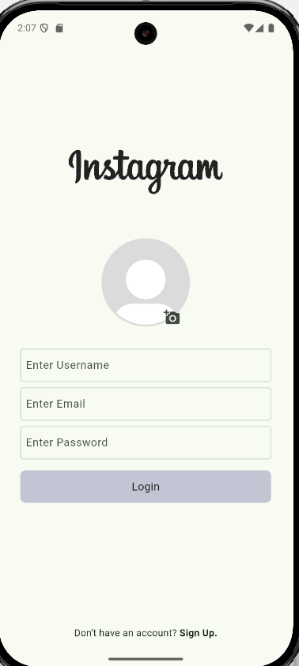
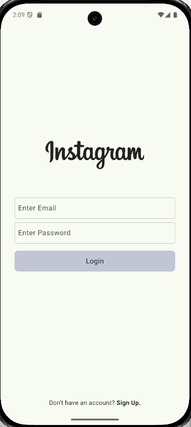
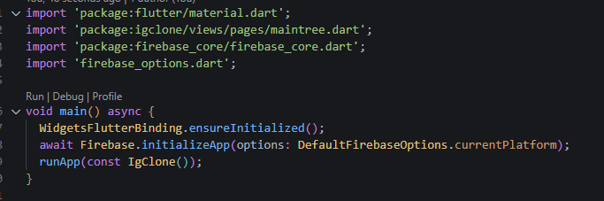
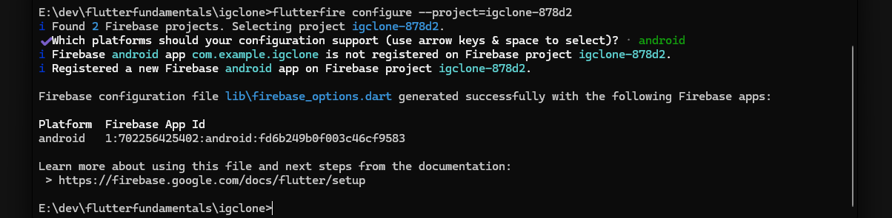
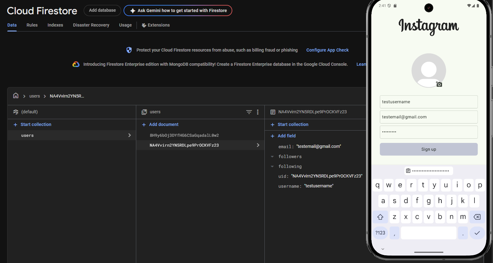
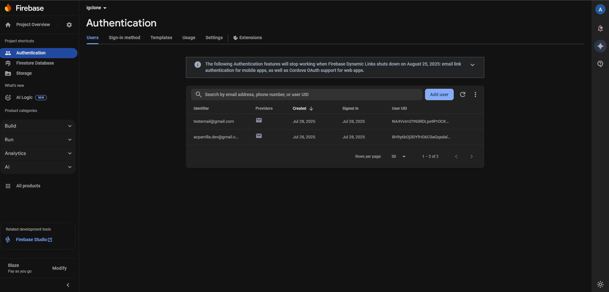
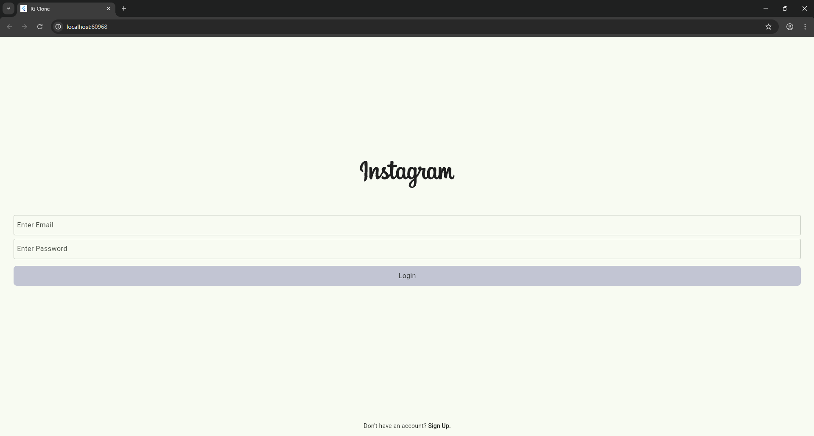
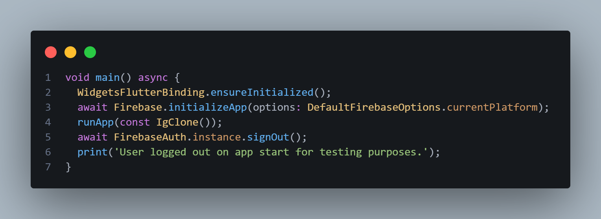
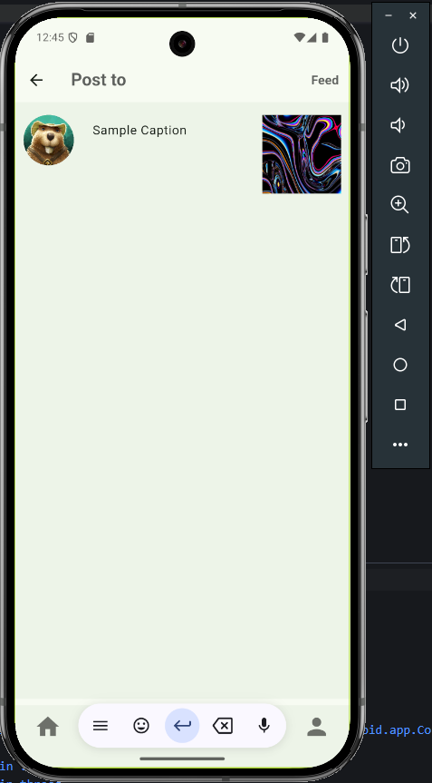

# igclone

*App Name - *IGClone*
*Goal - To build a scalable instagram clone using Dart/Flutter Framework to showcase what I've learned so far, and hopefully learn some more.*
*Target Audience - Potential employers.*

**Project Duration** : 25 July 2025 - 2 August 2025 (Ongoing improvements will follow.)
**Platform** - Primarily android, future development will target iOS, Web and Desktop.

### Development Log ###

# Day 1 - 25 July 2025

**Technical Research and Foundation Setup**
1. *Tech Stack Finalization*:
    - Selected Firebase for the backend services (Auth,Firestore,Storage,FCM, etc.)
    - Strongly considering Cloud Firestore over Data Connect.
        Key reasons:
            Realtime capabilities
            Offline support
            NoSQL architecture, which fits better with social media-style apps

2. *Widget Exploration*
    - Researching custom scrollable layouts for feed.
    - Considering ListView.builder Widget for the feed and stories, but horizontal scrollDirection for the stories.

3.  *Firebase setup*
    - Initialize firebase project.
    - 
    - 

4. *Next Steps*
   - Begin implementing the homepage layout (basic structure/skeleton).
   - Research about different state management options available for Flutter.
   - 
   - Will try and implement bottom navigation, dark mode on settings(?) and login page with auth hopefully  by day 2.

# Day 2 - 26 July 2025

**Continuation of layout implementation.**

1. - Implement basic route function for HomePage,SearchPage,AddNewPage,ReelsPage,ProfilePage using NavigationBar and ValueNotifier<>.
   - https://drive.google.com/file/d/1s7la7CnMos-eG7qD4b_eMoYiBInlpCU_/view?usp=drive_link
   

2. - **State Management Selection**:
        - Chose *Provider* based on:
            - Official flutter recommendation
            - Comprehensive documentation
            - Lower boilerplate for mid-scale apps
            - Seamless integration with ValueNotifier
            - Simplified widget rebuild control
        - Will perform a deep research regarding Provider and state management in general.

3.  - **Backend Refresher/Research**
        - Firebase fundamentals: Auth, Firestore, and Storage workflows
        - Analyze Instagram-like data structures for optimal NoSQL modeling

# Day 3 - 28 July 2025

1.  - Implement basic structure for login and register page.
        - 
        - 
2.  - Connect igclone to firebase.
        - 
        - 
        - 
        - 

# Day 4 - 29 July 2025

1.  - Implement register page that's already working with firebase backend
    - Implement upload profile photo function for the register page.
    - Implement workaround for users who chose not to upload a photo.
    - https://drive.google.com/file/d/1ezL3hskLxTYWWASy4BK7OGkywSnvn6sT/view?usp=drive_link

2.  - Initialized Flutter web support (`flutter create --platforms web .`)
        - Identified web-specific adaptations needed:
        - Responsive navigation redesign
        - Web-optimized image rendering
        - Auth flow adjustments for browsers
        -

3.  - Implement persisting auth state with help of Firebase Auth.
        - Just like the original instagram, users dont need to login everytime.
        - Will integrate with Provider for app-wide access to user state.
        - Session recovery flow:
            1. Check cached credentials on app launch
            2. Silent re-authentication if valid token exists
            3. Fallback to login screen if session expired
        - Persistent auth state will be temporarily disabled for testing purposes
        - 

# Day 4 - 30 July 2025

1.  - Implement 'Add Post' initial page.
    - 
    - Will implement add to story in the future.
